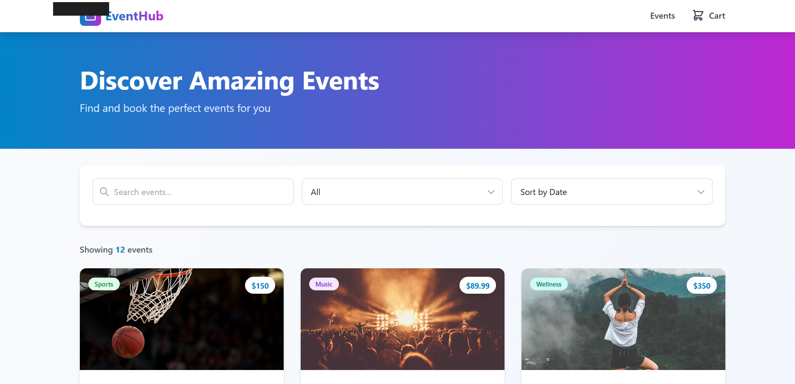
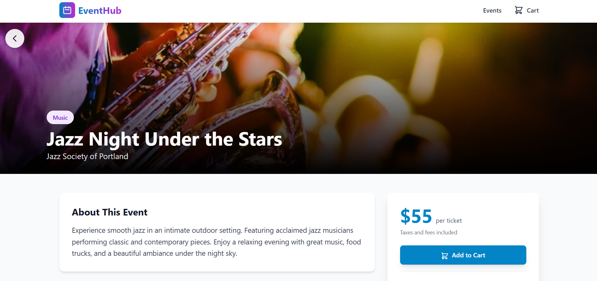
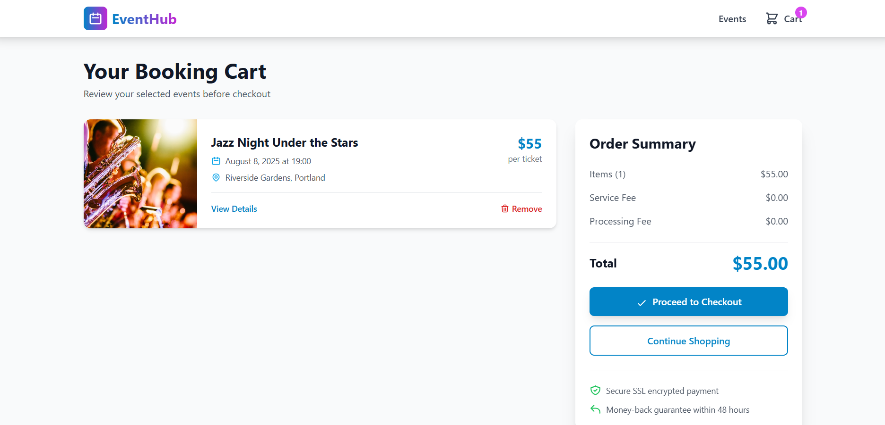

# EventHub - Event Booking Web Application

A professional, responsive React.js web application for browsing and booking events across multiple categories.

**Live Demo:** [https://bookingappexe.netlify.app](https://bookingappexe.netlify.app)  
**Source Code:** [https://github.com/monuwu/eventbookingapp](https://github.com/monuwu/eventbookingapp)

---

## Overview

EventHub is a production-ready event booking web application built with React.js and Tailwind CSS. It provides a seamless user experience for discovering, viewing, and booking events across various categories including Music, Technology, Sports, Art, Food, and Entertainment.

### Key Features

- **Modern UI/UX** - Clean, professional design with smooth animations
- **Responsive Design** - Works perfectly on desktop, tablet, and mobile devices
- **Smart Cart System** - Context API-based state management with localStorage persistence
- **Advanced Filtering** - Search, sort, and filter events by multiple criteria
- **Mobile-First Approach** - Optimized for all screen sizes
- **Performance Optimized** - Fast loading with optimized code

---

## Core Features

### 1. Event List Page
- Grid-based card layout with event information
- Real-time search functionality
- Category filtering (8 categories)
- Multiple sorting options (by date, price, name)
- Responsive design with smooth animations

### 2. Event Details Page
- Full-screen banner image
- Comprehensive event information
- Sticky booking card with pricing
- "Add to Cart" functionality
- Event tags and categories

### 3. Booking Cart Page
- List of selected events with images
- Remove item functionality
- Real-time total calculation
- Order summary
- Checkout simulation
- Empty cart state

### Additional Features
- Toast notification system
- LocalStorage cart persistence
- Duplicate prevention
- Smooth page transitions
- Professional footer with links

---

## Tech Stack

- **React 18.2** - Modern React with Hooks
- **React Router DOM 6.20** - Client-side routing
- **Tailwind CSS 3.3** - Utility-first CSS framework
- **Context API** - Global state management
- **LocalStorage API** - Data persistence
- **Netlify** - Hosting and deployment

---

## Project Structure

```
eventbookingapp/
├── public/
│   └── index.html
├── src/
│   ├── components/          # Reusable components
│   │   ├── Navbar.js
│   │   ├── Footer.js
│   │   ├── EventCard.js
│   │   └── Notification.js
│   ├── pages/               # Page components
│   │   ├── EventList.js
│   │   ├── EventDetails.js
│   │   └── BookingCart.js
│   ├── context/             # State management
│   │   └── BookingContext.js
│   ├── data/                # Mock data
│   │   └── events.js
│   ├── App.js
│   ├── index.js
│   └── index.css
├── package.json
├── tailwind.config.js
└── README.md
```

---

## Getting Started

### Prerequisites

- Node.js (v14 or higher)
- npm (v6 or higher)

### Installation

1. **Install Dependencies**
   ```bash
   npm install
   ```

2. **Start Development Server**
   ```bash
   npm start
   ```
   The app will open at `http://localhost:3000`

3. **Build for Production**
   ```bash
   npm run build
   ```

---

## Live Demo

Visit the deployed application: **[https://bookingappexe.netlify.app](https://bookingappexe.netlify.app)**

### Test the Features:
1. Browse 12 diverse events
2. Search for events (try "music" or "tech")
3. Filter by category
4. Sort by date/price/name
5. Click an event to view details
6. Add events to cart
7. View and manage cart
8. Test responsive design (resize browser)

---

## Screenshots

### Event List Page

*Browse events with search, filter, and sorting capabilities*

### Event Details Page

*Detailed event information with booking functionality*

### Booking Cart Page

*Manage selected events and view total amount*

---

## Technical Highlights

### React Features Implemented
- Functional components with Hooks
- useState, useEffect, useContext, useMemo
- Custom Context API for state management
- React Router for navigation
- Component composition and reusability

### State Management
- Global cart state with Context API
- LocalStorage integration for persistence
- Real-time updates across components
- Duplicate prevention logic

### UI/UX Design
- Tailwind CSS utility classes
- Custom color palette (Blue & Purple gradients)
- Smooth animations (fade-in, slide-up, scale-in)
- Hover effects and transitions
- Responsive breakpoints (mobile, tablet, desktop)
- Professional typography and spacing

---

## Event Categories

The application features events across 8 categories:
- Music - Concerts, festivals, live performances
- Technology - Conferences, summits, workshops
- Sports - Games, marathons, championships
- Art - Exhibitions, gallery shows
- Food - Food festivals, wine tastings
- Entertainment - Comedy shows, theater
- Business - Networking, pitch competitions
- Wellness - Yoga retreats, wellness events

---

## Code Quality

### Best Practices
- Clean, maintainable code structure
- Reusable component architecture
- Separation of concerns
- DRY principle (Don't Repeat Yourself)
- Consistent naming conventions
- Code comments where needed

### Performance Optimizations
- Memoized filtering and sorting (useMemo)
- Optimized image loading
- Code splitting with React Router
- Production build optimization

---

## Browser Support

- Chrome (latest)
- Firefox (latest)
- Safari (latest)
- Edge (latest)
- Mobile browsers (iOS Safari, Chrome Mobile)

---

## Learning Outcomes

This project demonstrates proficiency in:

1. **React Fundamentals** - Components, Props, State, Hooks
2. **State Management** - Context API, localStorage
3. **Routing** - React Router DOM, dynamic routes
4. **Styling** - Tailwind CSS, responsive design
5. **UX Design** - Loading states, notifications, empty states
6. **Code Organization** - Clean architecture, component separation
7. **Deployment** - Git, Netlify, CI/CD

---

## Author

Built as a React.js demonstration project showcasing modern web development practices and best practices.

**Technologies:** React • Tailwind CSS • Context API • React Router • Netlify

---

## License

This project is open source and available for educational purposes.

---

<div align="center">
  <p><strong>Live Demo:</strong> <a href="https://bookingappexe.netlify.app">https://bookingappexe.netlify.app</a></p>
  <p>Built with React & Tailwind CSS</p>
</div>
